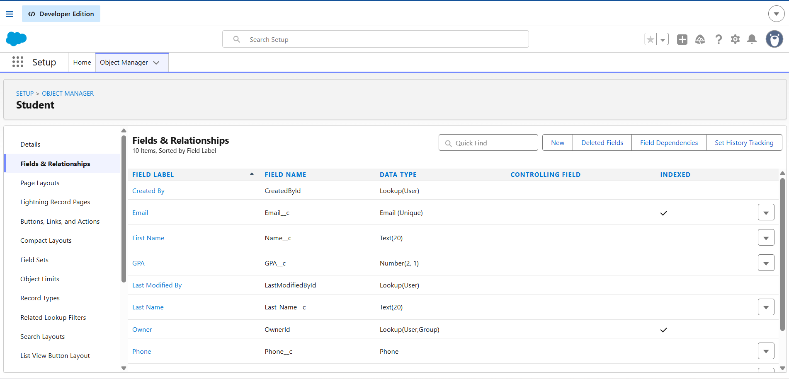
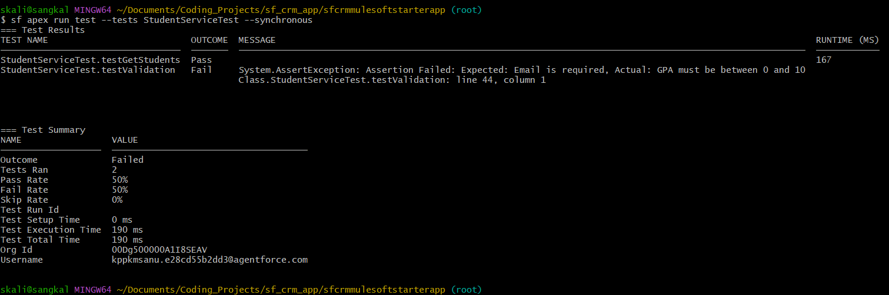
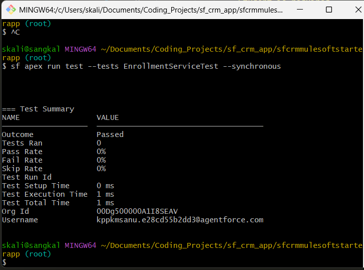
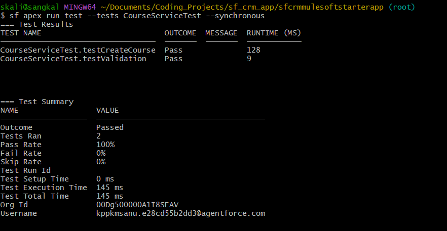
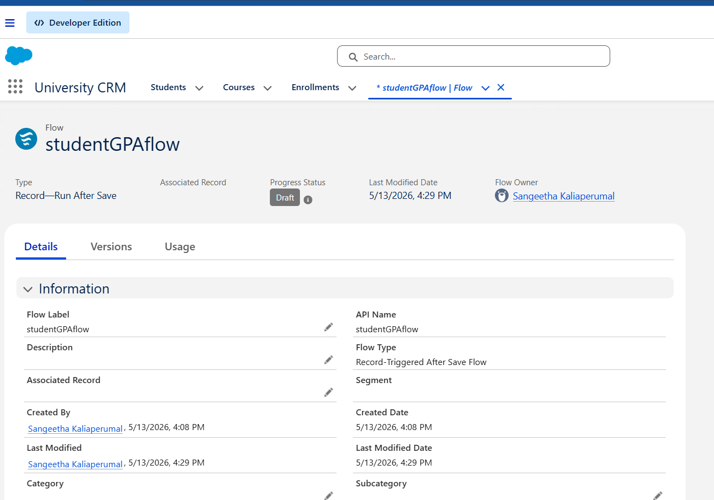

# University CRM - Salesforce Project

## Overview

This project is a simple University CRM application built on Salesforce to manage students, courses, and enrollments.

The goal of this project was to gain hands-on experience with the Salesforce ecosystem and demonstrate practical CRM development skills using Apex, SOQL, Flow Automation, and Salesforce DX.

---

## Features

- Student Management
- Course Management
- Enrollment Tracking
- GPA Validation
- Salesforce Flow Automation
- Apex Services
- Apex Test Classes

---

## Salesforce Components

### Custom Objects
- Student__c
- Course__c
- Enrollment__c

### Apex Classes
- StudentService
- CourseService
- EnrollmentService

### Test Classes
- StudentServiceTest
- CourseServiceTest
- EnrollmentServiceTest

---

## Validation Logic

Implemented validations include:
- GPA must be between 0 and 10
- Student email is required
- Course name is required
- Course code is required
- Enrollment requires both student and course

---

## Flow Automation

Created a Record-Triggered Flow to automatically update student status based on GPA.

```text
If GPA > 7
    → Status = Active
Else
    → Status = New
```

---

## Technologies Used

- Salesforce DX
- Apex
- SOQL
- Salesforce Flow Builder
- VS Code
- GitHub

---

## Project Structure

```text
force-app/
 └── main/
      └── default/
           ├── classes/
           ├── objects/
           └── flows/
```

---

## Screenshots

### Salesforce App


### Student Test Service


### Enrollment Test Service


### Course Test Service


### Flow Automation


---

## Future Improvements

- REST API integration
- Lightning Web Components (LWC)
- Dashboard reporting
- MuleSoft integration concepts

---

## Author

GitHub Repository:

[University CRM Repository](https://github.com/Sanganu/sf_crm_app)