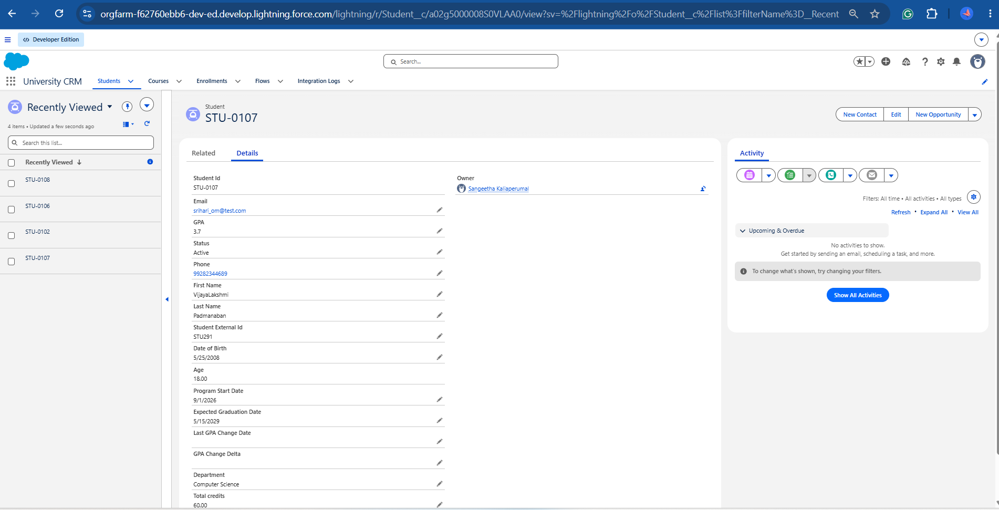
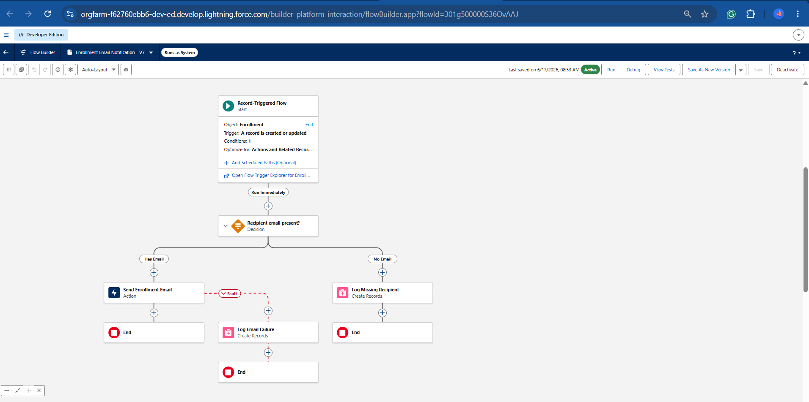
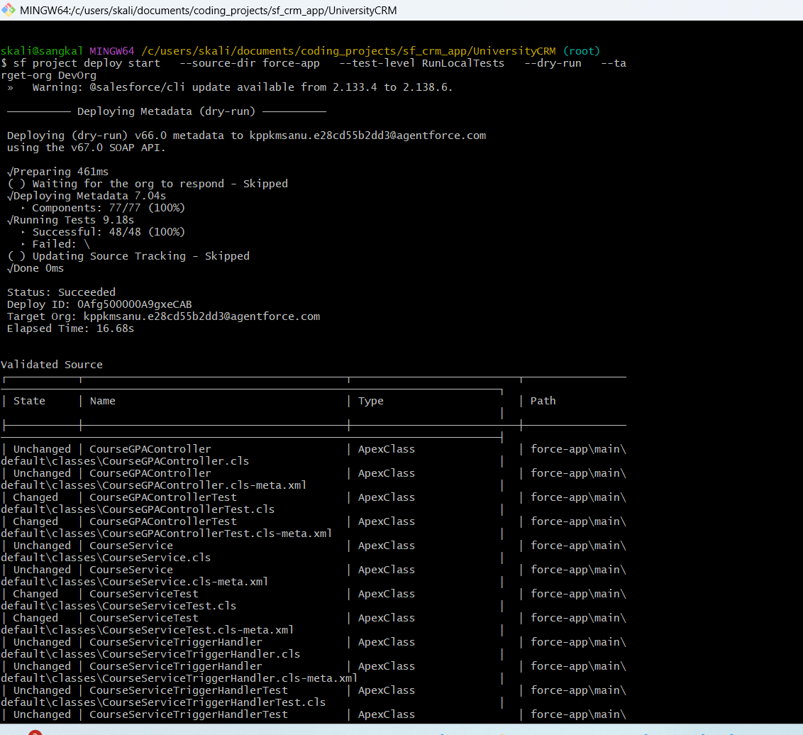
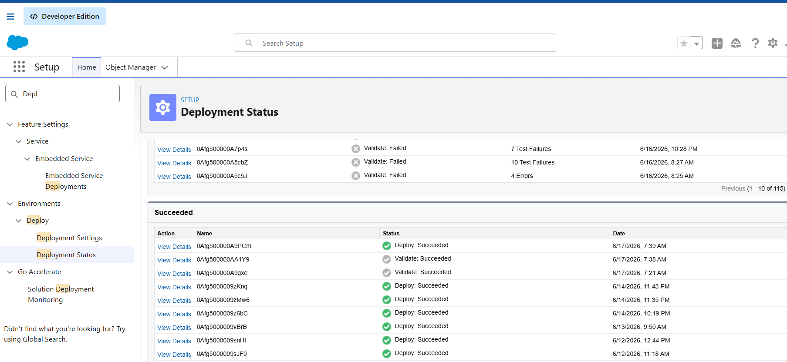

# University CRM - Salesforce Project

## Overview

A full-stack University CRM demonstrating end-to-end 
Salesforce development — Apex business logic, LWC 
front-end components, and a MuleSoft integration layer 
that mirrors a real university Banner-to-Salesforce pipeline.

## What's Built

### Salesforce — Data Model
- `Student__c` — GPA, Status, External ID, enrollment history
- `Course__c` — Capacity, Credits, Department, Active flag
- `Enrollment__c` — Junction object linking Student + Course

### Salesforce — Apex
- `TriggerHandler.cls` — Virtual base class, one trigger per object pattern
- `EnrollmentTriggerHandler.cls` — Capacity check, waitlist promotion, status validation
- `StudentTriggerHandler.cls` — GPA-based status automation
- `CourseServiceTriggerHandler.cls` — Course lifecycle management
- `EnrollmentService.cls` — @AuraEnabled methods for LWC
- `CourseService.cls` — Course queries and validation
- `StudentService.cls` — Student queries and GPA validation
- `CourseGPAController.cls` — DTO pattern, AggregateResult → typed wrapper for charts

### Salesforce — LWC
- `enrollmentPanel` — Displays live enrollments on Student Record Page using @wire
- `courseGPAChart` — Average grade per course on University Dashboard App Page

### Salesforce — Deployment
- Full Salesforce DX project structure
- Deployed via Salesforce CLI — `sf project deploy start`
- Developer org as sandbox environment

### MuleSoft Integration
- `work_flow_Stu_Enro_Cour.xml` — Full student upsert pipeline:
  - HTTP listener receives Banner payload
  - OAuth2 client credentials flow to Salesforce
  - DataWeave 2.0 transform — Banner fields → Salesforce fields
  - PATCH upsert by External ID (`Student_External_Id__c`)
  - foreach loop with per-record logging
- `api_create_stu.xml` — Inbound REST endpoint for new student creation
- `api_update_stu.xml` — Inbound REST endpoint for student updates

## Key Patterns Demonstrated

| Pattern | Implementation |
|---|---|
| Bulkification | All triggers use Set → Map → single SOQL + DML |
| Security | `WITH USER_MODE` in all SOQL, `insert/update as user` |
| Single Responsibility | Separate controller for UI data (CourseGPAController) |
| DTO Pattern | AggregateResult mapped to typed wrapper class |
| External ID Upsert | Student/Course/Enrollment all have External ID fields |
| Error handling | try/catch + AuraHandledException in all service classes |
| One trigger per object | TriggerHandler base class pattern |

## Test Coverage

- EnrollmentTriggerHandlerTest
- StudentTriggerHandlerTest  
- CourseServiceTriggerHandlerTest
- CourseGPAControllerTest
- StudentServiceTest
- CourseServiceTest
- EnrollmentServiceTest
- TriggerHandlerTest

---

## Technologies

- Salesforce DX + Salesforce CLI
- Apex + SOQL
- Lightning Web Components (LWC)
- MuleSoft + DataWeave 2.0
- VS Code + Salesforce Extension Pack
- GitHub

## Screenshots

### University Dashboard

### Enrollment Email Flow

### Deployment Log

### Deployment

---

## Author
Sangeetha Kaliaperumal  
[GitHub Repository](https://github.com/Sanganu/sf_crm_app)